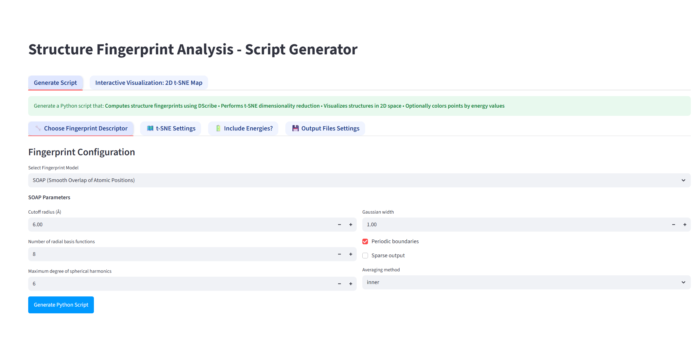
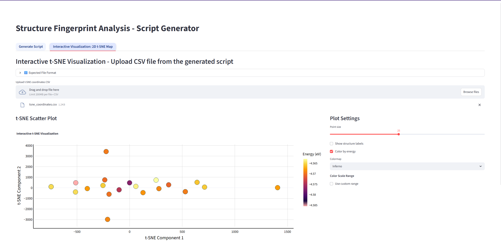
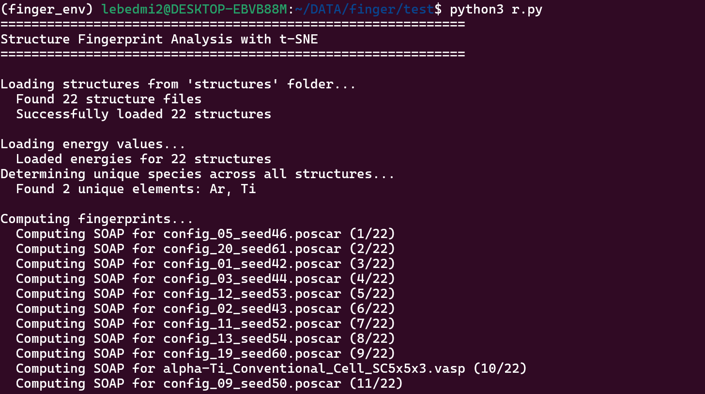

# structures-fingerprints
Prepare Python script to calculate fingerprints on crystal structures and convert them into 2D space with t-SNE.
Access the app here: https://fingerprints.streamlit.app/
See tutorial at (YouTube)[https://www.youtube.com/watch?v=717XxoA-XPo].

## Install prerequisities

**sudo apt update**  
**sudo apt install build-essential python3.12-dev python3-venv**  

Active Python virtual environment and install into it all necessary packages:
1) python3 -m venv finger_env
2) source finger_env/bin/activate
3) pip install dscribe numpy matplotlib scikit-learn ase dscribe pandas

